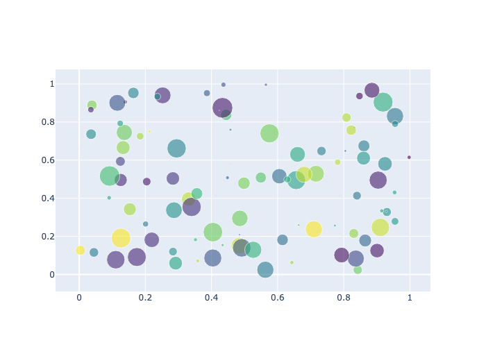
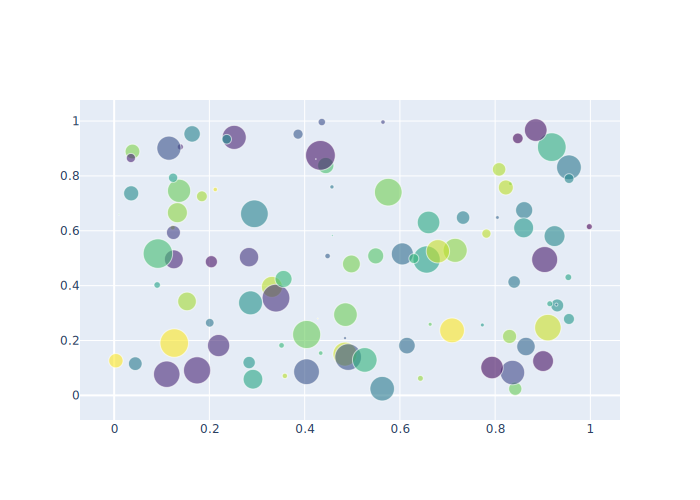
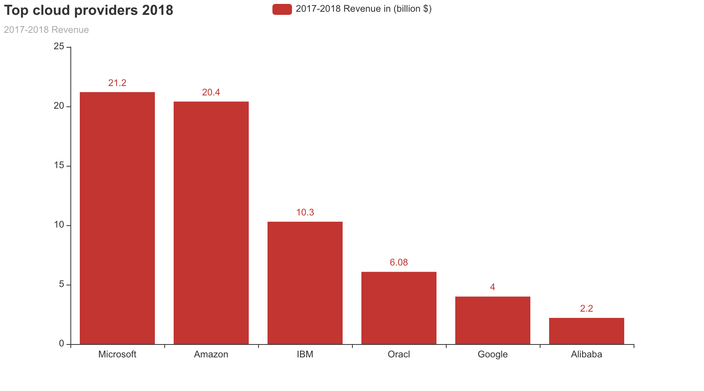

마크다운 제목
=======

# 해당 내용은 제목 부분입니다.

## 해당 내용은 부제목 부분입니다.

Plotly PNG  

해당 내용은 내용 부분입니다해당 내용은 내용 부분입니다해당 내용은 내용 부분입니다해당 내용은 내용 부분입니다해당 내용은 내용 부분입니다해당 내용은 내용 부분입니다해당 내용은 내용 부분입니다해당 내용은 내용 
부분입니다해당 내용은 내용 부분입니다해당 내용은 내용 부분입니다해당 내용은 내용 부분입니다해당 내용은 내용 부분입니다해당 내용은 내용 부분입니다해당 내용은 내용 부분입니다해당 내용은 내용 부분입니다해당 내용은 내용 
부분입니다해당 내용은 내용 부분입니다해당 내용은 내용 부분입니다해당 내용은 내용 부분입니다해당 내용은 내용 부분입니다해당 내용은 내용 부분입니다해당 내용은 내용 부분입니다해당 내용은 내용 부분입니다해당 내용은 내용 
부분입니다해당 내용은 내용 부분입니다해당 내용은 내용 부분입니다해당 내용은 내용 부분입니다해당 내용은 내용 부분입니다해당 내용은 내용 부분입니다해당 내용은 내용 부분입니다해당 내용은 내용 부분입니다해당 내용은 내용 
부분입니다해당 내용은 내용 부분입니다해당 내용은 내용 부분입니다해당 내용은 내용 부분입니다해당 내용은 내용 부분입니다해당 내용은 내용 부분입니다해당 내용은 내용 부분입니다해당 내용은 내용 부분입니다해당 내용은 내용 
부분입니다

Plotly SVG  

해당 내용은 내용 부분입니다해당 내용은 내용 부분입니다해당 내용은 내용 부분입니다해당 내용은 내용 부분입니다해당 내용은 내용 부분입니다해당 내용은 내용 부분입니다해당 내용은 내용 부분입니다해당 내용은 내용 
부분입니다해당 내용은 내용 부분입니다해당 내용은 내용 부분입니다해당 내용은 내용 부분입니다해당 내용은 내용 부분입니다해당 내용은 내용 부분입니다해당 내용은 내용 부분입니다해당 내용은 내용 부분입니다해당 내용은 내용 
부분입니다해당 내용은 내용 부분입니다해당 내용은 내용 부분입니다해당 내용은 내용 부분입니다해당 내용은 내용 부분입니다해당 내용은 내용 부분입니다해당 내용은 내용 부분입니다해당 내용은 내용 부분입니다해당 내용은 내용 
부분입니다해당 내용은 내용 부분입니다해당 내용은 내용 부분입니다해당 내용은 내용 부분입니다해당 내용은 내용 부분입니다해당 내용은 내용 부분입니다해당 내용은 내용 부분입니다해당 내용은 내용 부분입니다해당 내용은 내용 
부분입니다해당 내용은 내용 부분입니다해당 내용은 내용 부분입니다해당 내용은 내용 부분입니다해당 내용은 내용 부분입니다해당 내용은 내용 부분입니다해당 내용은 내용 부분입니다해당 내용은 내용 부분입니다해당 내용은 내용 
부분입니다

Plotly HTML

                            

            
        

해당 내용은 내용 부분입니다해당 내용은 내용 부분입니다해당 내용은 내용 부분입니다해당 내용은 내용 부분입니다해당 내용은 내용 부분입니다해당 내용은 내용 부분입니다해당 내용은 내용 부분입니다해당 내용은 내용 
부분입니다해당 내용은 내용 부분입니다해당 내용은 내용 부분입니다해당 내용은 내용 부분입니다해당 내용은 내용 부분입니다해당 내용은 내용 부분입니다해당 내용은 내용 부분입니다해당 내용은 내용 부분입니다해당 내용은 내용 
부분입니다해당 내용은 내용 부분입니다해당 내용은 내용 부분입니다해당 내용은 내용 부분입니다해당 내용은 내용 부분입니다해당 내용은 내용 부분입니다해당 내용은 내용 부분입니다해당 내용은 내용 부분입니다해당 내용은 내용 
부분입니다해당 내용은 내용 부분입니다해당 내용은 내용 부분입니다해당 내용은 내용 부분입니다해당 내용은 내용 부분입니다해당 내용은 내용 부분입니다해당 내용은 내용 부분입니다해당 내용은 내용 부분입니다해당 내용은 내용 
부분입니다해당 내용은 내용 부분입니다해당 내용은 내용 부분입니다해당 내용은 내용 부분입니다해당 내용은 내용 부분입니다해당 내용은 내용 부분입니다해당 내용은 내용 부분입니다해당 내용은 내용 부분입니다해당 내용은 내용 
부분입니다

pyecharts PNG  

해당 내용은 내용 부분입니다해당 내용은 내용 부분입니다해당 내용은 내용 부분입니다해당 내용은 내용 부분입니다해당 내용은 내용 부분입니다해당 내용은 내용 부분입니다해당 내용은 내용 부분입니다해당 내용은 내용 
부분입니다해당 내용은 내용 부분입니다해당 내용은 내용 부분입니다해당 내용은 내용 부분입니다해당 내용은 내용 부분입니다해당 내용은 내용 부분입니다해당 내용은 내용 부분입니다해당 내용은 내용 부분입니다해당 내용은 내용 
부분입니다해당 내용은 내용 부분입니다해당 내용은 내용 부분입니다해당 내용은 내용 부분입니다해당 내용은 내용 부분입니다해당 내용은 내용 부분입니다해당 내용은 내용 부분입니다해당 내용은 내용 부분입니다해당 내용은 내용 
부분입니다해당 내용은 내용 부분입니다해당 내용은 내용 부분입니다해당 내용은 내용 부분입니다해당 내용은 내용 부분입니다해당 내용은 내용 부분입니다해당 내용은 내용 부분입니다해당 내용은 내용 부분입니다해당 내용은 내용 
부분입니다해당 내용은 내용 부분입니다해당 내용은 내용 부분입니다해당 내용은 내용 부분입니다해당 내용은 내용 부분입니다해당 내용은 내용 부분입니다해당 내용은 내용 부분입니다해당 내용은 내용 부분입니다해당 내용은 내용 
부분입니다